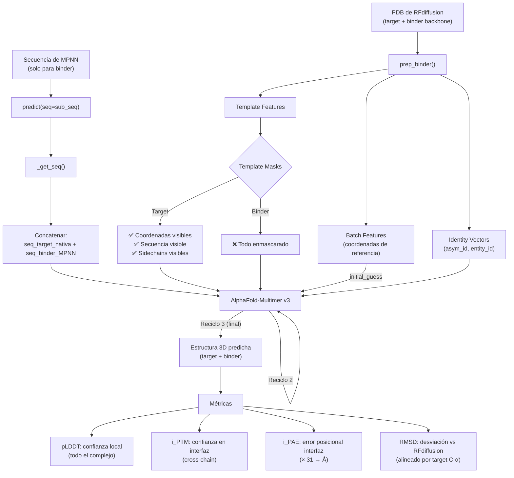

# AlphaFold-Multimer Validation: Deep Dive Técnico

## Resumen Ejecutivo

> [!IMPORTANT]
> **Sí, se predice el complejo completo (target + binder).** AlphaFold-Multimer recibe la secuencia concatenada de AMBAS cadenas y predice la estructura 3D de todo el ensamblaje. La estructura del target se mantiene fiel al original gracias a un **mecanismo de template** que inyecta las coordenadas cristalográficas del target como información estructural de referencia.

---

## Flujo Secuencial Detallado

A continuación, el recorrido exacto que siguen los datos, rastreado archivo por archivo en el código fuente de ColabDesign.

### Paso 1: Invocación desde el Notebook

El notebook llama al script [designability_test.py](file:///home/cristofer/.conda/envs/prot_design/lib/python3.11/site-packages/colabdesign/rf/designability_test.py):

```python
!python colabdesign/rf/designability_test.py {opts}
```

El script recibe argumentos como:
- `--pdb=<backbone de RFdiffusion>`
- `--contig=<definición de cadenas>`
- `--use_multimer` (activa AF-Multimer v3)
- `--initial_guess` (inyecta coordenadas como punto de partida)
- `--num_recycles=3`

---

### Paso 2: Clasificación del Protocolo

En [designability_test.py L86-98](file:///home/cristofer/.conda/envs/prot_design/lib/python3.11/site-packages/colabdesign/rf/designability_test.py#L86-L98), el script analiza los contigs para determinar qué tipo de tarea es:

```python
if sum(both_chains) == 0 and sum(fixed_chains) > 0 and sum(free_chains) > 0:
    protocol = "binder"
    af_model = mk_af_model(protocol="binder", **flags)
```

Para diseño de binders, identifica:
- **`fixed_chains`** (cadenas con residuos fijos) → se asignan como **target**
- **`free_chains`** (cadenas con residuos generados por RFdiffusion) → se asignan como **binder**

Los flags que se pasan a `mk_af_model` son:

```python
flags = {
    "initial_guess": True,        # usar coordenadas de RFdiffusion como punto de partida
    "best_metric": "rmsd",
    "use_multimer": True,
    "model_names": ["model_1_multimer_v3"]
}
```

---

### Paso 3: Construcción del Modelo AF (`mk_af_model`)

En [model.py L23-45](file:///home/cristofer/.conda/envs/prot_design/lib/python3.11/site-packages/colabdesign/af/model.py#L23-L45):

```python
class mk_af_model:
    def __init__(self, protocol="fixbb", use_multimer=False, ...):
        if self.protocol == "binder":
            self._args["use_templates"] = True  # ← CRUCIAL
```

> [!IMPORTANT]
> **Para el protocolo `binder`, los templates SIEMPRE se activan automáticamente**, independientemente de lo que el usuario pase. Esto es lo que permite anclar la estructura del target.

El modelo se configura con los pesos de `model_1_multimer_v3` y se compila con JAX.

---

### Paso 4: Preparación de Inputs (`_prep_binder`)

En [prep.py L176-268](file:///home/cristofer/.conda/envs/prot_design/lib/python3.11/site-packages/colabdesign/af/prep.py#L176-L268), se ejecuta `af_model.prep_inputs(pdb_filename, target_chain="A", binder_chain="B")`.

Este paso hace lo siguiente:

#### 4a. Lectura del PDB completo
```python
self._pdb = prep_pdb(pdb_filename, chain=chains, ignore_missing=im)
```
Se lee la estructura PDB generada por RFdiffusion, que contiene **tanto el target como el binder**. Se extraen las coordenadas atómicas, los tipos de aminoácido, y los índices de residuos de AMBAS cadenas.

#### 4b. Definición de longitudes
```python
self._target_len = sum([(self._pdb["idx"]["chain"] == c).sum() for c in target_chain.split(",")])
self._binder_len = sum([(self._pdb["idx"]["chain"] == c).sum() for c in binder_chain.split(",")])
self._len = self._binder_len  # ← _len solo cubre el binder
self._lengths = [self._target_len, self._binder_len]
```

> [!NOTE]
> `self._len` (la longitud "diseñable") se establece como la longitud del **binder solamente**. Pero `self._lengths` contiene ambas longitudes. Esto es crucial para entender que el modelo predice todo, pero solo "diseña" el binder.

#### 4c. Configuración del residue_index (identidad de cadenas)
```python
res_idx = self._pdb["residue_index"]  # índices de todo el complejo
```

Los residuos del target y del binder se separan con un **offset de 50 posiciones** en el `residue_index`. Esto le indica a AlphaFold-Multimer que son cadenas separadas.

#### 4d. Configuración de asym_id/entity_id (para Multimer)
```python
self._inputs.update(get_multi_id(self._lengths))
```

La función `get_multi_id` crea vectores de identidad:
```python
def get_multi_id(lengths, homooligomer=False):
    i = np.concatenate([[n]*l for n,l in enumerate(lengths)])
    return {"asym_id": i, "sym_id": i, "entity_id": i}
```

Esto produce:
- `asym_id = [0,0,...,0, 1,1,...,1]` → residuos 0..target_len-1 son cadena 0, el resto cadena 1
- `entity_id = [0,0,...,0, 1,1,...,1]` → son entidades biológicas diferentes

> [!IMPORTANT]
> Estos vectores son los que le dicen al módulo Multimer de AlphaFold que está modelando un **complejo heterodímero** con dos entidades independientes. Sin esto, AF trataría todo como un monómero.

#### 4e. Configuración de las máscaras de template

```python
rm_opt = {
    "rm_template":    {"target": False,   "binder": True},   # ← NO remover template del target
    "rm_template_seq":{"target": False,   "binder": True},   # ← NO remover seq del template para target
    "rm_template_sc": {"target": False,   "binder": True}    # ← NO remover sidechains del template para target
}
```

Esto significa:
- **Para el TARGET**: se conservan TODAS las features del template (coordenadas, secuencia, sidechains)
- **Para el BINDER**: se REMUEVEN todas las features del template (coordenadas, secuencia, sidechains)

> [!CAUTION]
> Esta configuración asimétrica de templates es **el mecanismo central** que permite que la estructura del target se mantenga fiel al original. El target recibe información estructural privilegiada; el binder no recibe ninguna.

#### 4f. Batch con coordenadas atómicas reales
```python
self._inputs["batch"] = self._pdb["batch"]
```

El `batch` contiene las posiciones atómicas reales (de RFdiffusion) del complejo completo. Estas se usarán como:
1. Template para guiar la predicción
2. Referencia para calcular el RMSD al final

---

### Paso 5: Inyección de la Secuencia de MPNN (`_get_seq`)

En [designability_test.py L166-167](file:///home/cristofer/.conda/envs/prot_design/lib/python3.11/site-packages/colabdesign/rf/designability_test.py#L166-L167):

```python
sub_seq = out["seq"][n].replace("/","")[-af_model._len:]
af_model.predict(seq=sub_seq, num_recycles=o.num_recycles, verbose=False)
```

La secuencia de MPNN se pasa a `predict()`. Internamente, en [inputs.py L24-28](file:///home/cristofer/.conda/envs/prot_design/lib/python3.11/site-packages/colabdesign/af/inputs.py#L24-L28):

```python
if self.protocol == "binder":
    # concatenate target and binder sequence
    seq_target = jax.nn.one_hot(inputs["batch"]["aatype"][:self._target_len], 20)
    seq_target = jnp.broadcast_to(seq_target, (self._num, *seq_target.shape))
    seq = jax.tree_map(lambda x: jnp.concatenate([seq_target, x], 1), seq)
```

> [!IMPORTANT]
> **La secuencia del TARGET se toma directamente del PDB original** (los aminoácidos reales, codificados como one-hot). La secuencia del BINDER es la generada por ProteinMPNN. Ambas se **concatenan** para formar la secuencia completa del complejo que AlphaFold va a predecir.

Esto responde directamente tu pregunta: **la secuencia del target NO cambia nunca**. Se usa la secuencia nativa real del PDB.

---

### Paso 6: Inyección de las Coordenadas como Template (`_update_template`)

En [inputs.py L49-107](file:///home/cristofer/.conda/envs/prot_design/lib/python3.11/site-packages/colabdesign/af/inputs.py#L49-L107):

```python
def _update_template(self, inputs, key):
    inputs["template_mask"] = inputs["template_mask"].at[0].set(1)  # activar template
    
    rm     = inputs.get("rm_template", False)      # [False...False, True...True]
    rm_seq = where(rm, True, inputs.get("rm_template_seq", True))  # target: False, binder: True
    rm_sc  = where(rm_seq, True, inputs.get("rm_template_sc", True))
    
    # Las posiciones del template donde rm_seq=True → aatype se reemplaza con 21 (unknown)
    template_feats = {"template_aatype": where(rm_seq, 21, batch["aatype"])}
    
    # Coordenadas pseudo-CB: donde rm_seq=True → se calcula CB como si fuera Glycina (index 0)
    cb, cb_mask = pseudo_beta_fn(where(rm_seq, 0, batch["aatype"]),
                                  batch["all_atom_positions"],
                                  batch["all_atom_mask"])
    
    # Inyectar en template slot 0
    inputs[k] = inputs[k].at[0].set(v)
    
    # Remover sidechains donde rm_sc=True (para el binder)
    inputs["template_all_atom_mask"] = inputs[k].at[...,5:].set(
        where(rm_sc[:,None], 0, inputs[k][...,5:]))
    inputs["template_all_atom_mask"] = where(rm[:,None], 0, inputs[k])
```

En resumen, lo que sucede con el template:

| Feature | Target (posiciones 0..T-1) | Binder (posiciones T..T+B-1) |
|---|---|---|
| `template_aatype` | Aminoácidos reales del PDB | `21` (unknown/masked) |
| `template_pseudo_beta` | Coordenadas CB reales | Coordenadas (tratadas como Gly) |
| `template_all_atom_positions` | Todas las coordenadas atómicas | Todas las coordenadas atómicas |
| `template_all_atom_mask` | **Todo visible** (backbone + sidechains) | **Todo enmascarado** (ceros) |

> [!CAUTION]
> Para el binder: aunque las posiciones atómicas del template técnicamente existen en el array, la **máscara** (`template_all_atom_mask`) se pone a cero. Esto significa que AlphaFold **no puede ver** las coordenadas del binder en el template. Sabe dónde está el target, pero tiene que "adivinar" dónde queda el binder.

---

### Paso 7: Initial Guess (Inyección de coordenadas previas)

En [design.py L162-169](file:///home/cristofer/.conda/envs/prot_design/lib/python3.11/site-packages/colabdesign/af/design.py#L162-L169):

```python
if a["use_initial_guess"] and "batch" in self._inputs:
    prev["prev_pos"] = self._inputs["batch"]["all_atom_positions"]
```

Cuando `initial_guess=True`, las coordenadas atómicas de **todo el complejo** (target + binder, tal como salieron de RFdiffusion) se inyectan como `prev_pos`. Esto inicializa el sistema de reciclaje de AlphaFold con coordenadas cercanas al diseño deseado.

> [!NOTE]
> `initial_guess` y `template` son mecanismos **complementarios**:
> - **Template**: información estructural que pasa por el módulo de templates de AF → influencia el Evoformer
> - **Initial Guess**: coordenadas iniciales que alimentan el primer ciclo del Structure Module → influencia las posiciones atómicas iniciales

Ambos trabajan juntos para que AlphaFold converja hacia una estructura razonable.

---

### Paso 8: Ejecución del Modelo (`_recycle`)

En [design.py L147-206](file:///home/cristofer/.conda/envs/prot_design/lib/python3.11/site-packages/colabdesign/af/design.py#L147-L206):

```python
def _recycle(self, model_params, num_recycles=None, backprop=True):
    mode = "last"  # solo el último reciclo contribuye al gradiente
    
    for m in mask:  # [0, 0, 0, 1] para 3 reciclos
        aux = self._single(model_params, backprop=(m != 0))
        self._inputs["prev"] = aux["prev"]  # pasar output como input del siguiente ciclo
```

El reciclaje funciona así:
1. **Ciclo 0**: AF toma el `initial_guess` + template + secuencia → genera estructura 3D
2. **Ciclo 1**: AF toma la estructura del ciclo 0 + template + secuencia → refina
3. **Ciclo 2**: AF toma la estructura del ciclo 1 + template + secuencia → refina
4. **Ciclo 3**: AF toma la estructura del ciclo 2 + template + secuencia → **predicción final**

En cada ciclo, AF tiene acceso a:
- La secuencia completa (target nativa + binder de MPNN)
- El template (coordenadas reales del target, binder enmascarado)
- Las coordenadas predichas del ciclo anterior (`prev_pos`)

---

### Paso 9: Extracción de Métricas (Post-predicción)

En [model.py L195-208](file:///home/cristofer/.conda/envs/prot_design/lib/python3.11/site-packages/colabdesign/af/model.py#L195-L208):

```python
outputs = runner.apply(model_params, key(), inputs)

aux.update({
    "atom_positions": outputs["structure_module"]["final_atom_positions"],
    "plddt":          get_plddt(outputs),
    "pae":            get_pae(outputs),
    "ptm":            get_ptm(inputs, outputs),
    "i_ptm":          get_ptm(inputs, outputs, interface=True),
})
```

#### 9a. pLDDT
Calculado en [loss.py L188-194](file:///home/cristofer/.conda/envs/prot_design/lib/python3.11/site-packages/colabdesign/af/loss.py#L188-L194): es la confianza local de AF en cada residuo, computada sobre **todo el complejo**. En `designability_test.py`, se reporta el valor promedio sobre todos los residuos.

#### 9b. i_PTM (Interface PTM)
Calculado en [loss.py L204-213](file:///home/cristofer/.conda/envs/prot_design/lib/python3.11/site-packages/colabdesign/af/loss.py#L204-L213): usa `asym_id` para identificar la interfaz. Solo considera pares de residuos que pertenecen a **cadenas diferentes** (target vs binder).

#### 9c. i_PAE (Interface PAE)
En `designability_test.py` se normaliza:
```python
out["i_pae"][-1] = out["i_pae"][-1] * 31  # convertir de [0,1] a Ångströms
```

#### 9d. RMSD
Calculado en [loss.py L438-495](file:///home/cristofer/.conda/envs/prot_design/lib/python3.11/site-packages/colabdesign/af/loss.py#L438-L495):

```python
def get_rmsd_loss(inputs, outputs, L=None, include_L=True, copies=1):
    true = batch["all_atom_positions"][:,1]   # C-alpha del PDB original
    pred = outputs["structure_module"]["final_atom_positions"][:,1]  # C-alpha predicho
```

Para el protocolo binder, el RMSD se calcula así (en `_loss_binder`, líneas 63 y 80):

```python
# Alinear usando SOLO los C-alpha del TARGET (posiciones 0..tL)
align_fn = get_rmsd_loss(inputs, outputs, L=tL)["align"]

# El RMSD reportado en designability_test se calcula sobre TODO
# usando la alineación basada en el target
```

> [!IMPORTANT]
> La alineación (Kabsch) se realiza usando **solo los átomos del target** como referencia. Luego, el RMSD se computa sobre las posiciones alineadas. Esto mide qué tan bien el binder predicho por AF se superpone con el binder diseñado por RFdiffusion, **después de haber alineado ambas estructuras usando el target como ancla**.

---

## Respuestas Directas a tus Preguntas

### ¿Se predice el complejo target-binder completo?
**Sí, absolutamente.** AlphaFold-Multimer recibe la secuencia completa `[seq_target + seq_binder]` y predice las coordenadas 3D de **todos** los átomos del complejo. El output `final_atom_positions` tiene dimensiones `[L_total, 37, 3]` donde `L_total = L_target + L_binder`.

### ¿Se predice únicamente el binder?
**No.** El binder NUNCA se predice de forma aislada en este pipeline. Sería imposible evaluar la interacción target-binder si solo se predijera el binder.

### ¿Cómo nos aseguramos de que el target sea igual al target inicial?

Hay **tres mecanismos** que trabajan en conjunto:

1. **Template con coordenadas reales del target**: Las coordenadas atómicas del target se inyectan como template con máscara completa (backbone + sidechains visibles). El módulo de templates de AlphaFold usa esta información geométrica directamente en el Evoformer.

2. **Secuencia nativa del target**: La secuencia del target no es generada por MPNN. Se toma directamente del PDB original (`inputs["batch"]["aatype"][:target_len]`), codificada como one-hot.

3. **Initial Guess**: Las coordenadas de todo el complejo (incluyendo el target) se usan como posiciones iniciales para el Structure Module.

El resultado práctico es que **la estructura predicha del target por AF queda prácticamente idéntica a la estructura original**. Las desviaciones son mínimas (típicamente < 0.5 Å RMSD para el target), porque AF tiene toda la información necesaria para "reproducir" esa estructura. Lo interesante es lo que AF hace con el **binder**: al no tener template, AF debe determinar de forma independiente si la secuencia del binder (de MPNN) realmente se pliega y se acopla al target.

---

## Diagrama de Flujo


